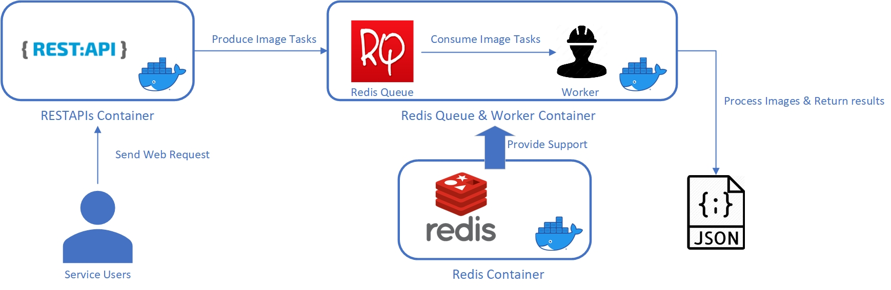
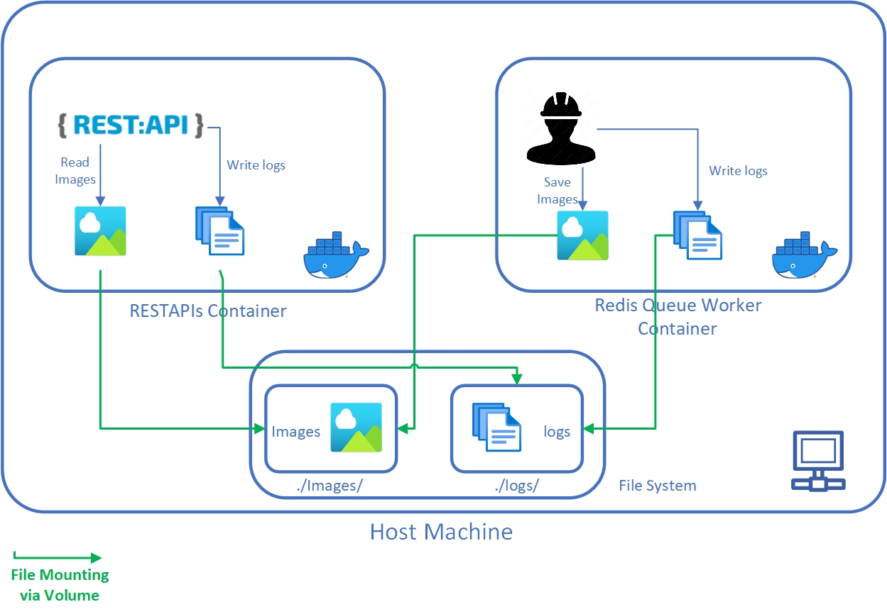

# ReadMe

## Get Started
Welcome to this image resizing project. This documentation has all the contents you needed to understand, run and test this project. To have the perfect experiences, please follow this readme step by step. Wish you could have fun!

## Prerequisites
To run this image resizing service successfully, the following prerequisites must be satisfied. Please make sure that you do not miss any of them.
1. A laptop with mainstream OS & terminal installed  
For Windows: Windows Command Prompt  
For Mac OS & Linux: Terminal
2. Has Docker installed  
Run `docker --version` to confirm this  
If you have not installed docker yet, please move here to install their latest stable version - [Docker](https://www.docker.com/).
3. Has Git installed  
Run `git --version` to confirm this  
If you have not installed git yet, please move here to install their latest stable version - [Git](https://git-scm.com/).
4. A tool that could get access to the REST Service Endpoint of this project. At least one of the following tools should be installed:  
4.1 **cURL** - A command line tool that could send web requests and transfer data via terminal. To install cURL, Please move here - [cURL](https://curl.se/).   
4.2 **RESTAPI Testing Software** - An API testing software could help you achieve accessing our APIs as well. Here we suggests to use [Postman](https://www.postman.com/).  
For myself, I choosed Postman as it is straightforward and easy to operate.  
5. A Python IDE that could open & manage this project. And could run the 2 Unit Test files in this project.  
For myself, I choose to use [Visual Studio Code](https://code.visualstudio.com/) with its [Python Extension](https://marketplace.visualstudio.com/items?itemName=ms-python.python) installed.

## Project Introduction
This project is a backend web application. It provides image size related services - Get the 2D size of an image, or resize any given images to 100×100pt thumbnail.

### Architecture
Image processing could be time-consuming. To support continous and long running image processing ability, this service has been designed as a task queue based application - more specifically, it uses **Redis Queue** to deal with continuous incoming image tasks. To support the running of Redis Queue, obviously **Redis** is necessary as well. To enable the users to interact with this service, the **RESTAPIs** are provided. Last but not least, there should be **workers** as well to continously deal with images and output results to the users.  

Therefore, the whole application is composed by 3 microservices - **RESTAPIs**, **Redis Queue & Workers** and **Redis**. Also, all of them are implemented via **Python**.  

To better manage these microservices seperately, **all of them are containerized** via Docker respectively. The following diagaram demonstrates all the main components and their relationships:  

    

As it displays, at the **producer end** of Redis Queue, when service user submits an image request to the RESTAPI, the API will treat it as an image task, and put it into the queue.

On the other hand, at the **consumer end** of the queue, there will be workers handling these image processing tasks. They take those tasks out of the queue, and utilize **image APIs** to process images. Meanwhile, they will write logs to record their behaviors as well.  
When the tasks are done, queue workers will return the result in JSON. Users could either hit the RESTAPI, or directly visit the destination folders, to get their image processing results.  

In addition, to enable the service to read & write image files, the **containers of RESTAPIs & Workers** have been set up to **utilize volumes to mount the image directory in host machines** to both containers. All the images stored under `./images/` folder could be processed by this service.

Similar to log writing as well. The folder `./logs/` is mounted to both containers as well. They could write logs under this folder when they are executing.  

The following diagram could better demonstrate this process:  



As the chart above shows, the images & logs writing could reflect the run-time behaviors of this service, which make it become both achievable & monitorable.

### Project Files Overview
1. Directories  
    * **docimgs** - includes all images that are used in this ReadMe  
    * **images** - includes all the images that could be processed by this application
    * **logs** - stores all the logs written by this application while its running
2. Files  
    * **docker-compose.yml** & **Dockerfile** - Recorded detailed configurations of the 3 containers above
    * **Image.py** - Defined all the image APIs that could be utilized by Workers to process images.
    * **log.py** - Defined a log function. Used by RESTAPI & Workers to write logs.
    * **RedisConfig.py** - Set up Redis Server & initialized Redis Queue.
    * **requirements.txt** - Listed all the python module dependencies that 3 containers need to install.
    * **RestAPI.py** - Defined all the REST Endpoints where users could get access to and send image request.  
    * **TestImage.py** - Defined all the unit test functions for testing the methods in Image.py.
    * **TestRestAPI.py** - Defined all the unit test functions for testing the Rest Endpoint methods in RestAPI.py.

### Referenced Libraries
As listed in `./requirements.txt` file, this application references 4 python modules:  
* **Flask** - Provides the web framework & facilitates the REST Endpoints development for this project.
* **Pillow** - Provides necessary image processing APIs. Make it possible for this application to resize images.
* **Redis** - Enable the application to get access to Redis.
* **RQ (Redis Queue)** - Enable the application to utilize Redis Queue.

### RESTAPIs Overview
This application offeres 3 APIs that users could get access to. Their functionalities and usage ways are listed below:
1. Get Image Size API
    * Effect - Request to get the size of a given image
    * HTTP Method - `GET`
    * Parameters - `imagePath` (**Mandatory**)
    * Usage - Hit the following URL via cURL or Postman:
    `http://127.0.0.1:5000/imageapi?imagePath=<Your image path>`  
    The parameter `imagePath` is mandatory. You should specify the absolute path of a image by yourself. Notice that all the image paths should start with `/ImageResize/images/`, **as they are the ones in container, not in your laptop**. The path `/ImageResize/images/*` is equivalent to `./images/*`, on your laptop.   
    * Return - JSON data will be returned. If the request is valid, the API will **return a success message and a jobId** that you could get the result later. Otherwise, it will **return a failure message**.
    * Example - Get the size of example image `CogentLabs.jpg`.  
        * Start the application
        * Open Postman, Select the method as `GET`  
        * Send the following request to this application via Postman:  
    `http://127.0.0.1:5000/imageapi?imagePath=/ImageResize/images/CogentLabs.jpg`  
        * The service returns the following JSON data:  
        ```
        {  
            "Result": "Task: Get the size of image [/ImageResize/images/CogentLabs.jpg] has been put into queue",  
            "jobId": "c99162f2-0b99-4b45-9884-1cc7af3d378d"
        }
        ```
        Notice that you could use the returned `jobId` to further get the processing result from workers. The result could be kept for 500 seconds.

2. Resize Image API
    * Effect - Request to resize a given image or a given batch of images to 100×100pt thumbnail.
    * HTTP Method - `POST`
    * Parameters - `imagePath` (**Mandatory**)
    * Usage - Hit the following URL via cURL or Postman:
    `http://127.0.0.1:5000/imageapi?imagePath=<Your image path>`  
    The parameter `imagePath` is mandatory. You should specify the absolute path of a image or a folder by yourself. Notice that all the image paths should start with `/ImageResize/images/`, **as they are the ones in container, not in your laptop**.The path `/ImageResize/images/*` is equivalent to `./images/*` on your laptop.   
    Also, if you give a single image path, only that target image will be resized. Instead, if you give a directory, all the images under that folder will be resized (**Not recursive**).
    * Return - JSON data will be returned. If the request is valid, the API will **return a success signal and a jobId** that you could get the result later. Otherwise, it will **return a failure message and a failure signal**.
    * Example - Resize the example image `CogentLabs.jpg`.  
        * Start the application
        * Open Postman, Select the method as `POST`  
        * Send the following request to this application via Postman:  
    `http://127.0.0.1:5000/imageapi?imagePath=/ImageResize/images/CogentLabs.jpg`  
        * The service returns the following JSON data:  
        ```
        {  
            "Result": "Task: Resize image [/ImageResize/images/CogentLabs.jpg] has been put into queue",  
            "jobId": "6f950a07-7eb6-454e-856b-ab2d15d5efd8"  
        }
        ```
        Notice that you could use the returned `jobId` to further get the processing result from workers. The result could be kept for 500 seconds.
3. Get Result API
    * Effect - Get the task results that was finished processing by Workers.
    * HTTP Method - `GET`
    * Parameters - `jobId` (**Mandatory**)
    * Usage - Hit the following URL via cURL or Postman:
    `http://127.0.0.1:5000/result?jobId=<Your Own JobID>`  
    The parameter `jobId` is mandatory. You should specify it by utilizing the return results from previous 2 APIs.
    * Return - JSON data will be returned. If the jobId is valid, you will see **the image process result returned by those image functions**. Otherwise, you will see **a failure message complains about the invalid jobId or other errors**.
    * Example - Get the results of previous 2 tasks handling example image `CogentLabs.jpg`.  
        * Start the application
        * Open Postman, Select the method as `GET`  
        * Send the following 2 requests to this application via Postman:  
        `http://127.0.0.1:5000/result?jobId=c99162f2-0b99-4b45-9884-1cc7af3d378d`  
        `http://127.0.0.1:5000/result?jobId=6f950a07-7eb6-454e-856b-ab2d15d5efd8`

        * The service returns the following JSON data respectively:  
        For `jobId=c99162f2-0b99-4b45-9884-1cc7af3d378d`  
        ```
        {  
            "Height": 830,  
            "Result": "Get the size of target image successfully.",  
            "Width": 1996
        } 
        ```  
        The data above display that the worker successfully get the size of our example image `CogentLabs.jpg` - its Height & Width are 830 and 1996 respectively.  
        For `jobId=6f950a07-7eb6-454e-856b-ab2d15d5efd8`
        ```
        {  
            "Message": "/ImageResize/images/resized/CogentLabs_resized.jpg",  
            "Resize": true  
        }
        ```
        The data above display that the worker successfully resized our example image `CogentLabs.jpg` and stored the new one to path `/ImageResize/images/resized/CogentLabs_resized.jpg`. If you step to the folder `./image/resized/`, you will discovered a small image `CogentLabs_resized.jpg` is generated, which is exactly what we want.

You can know more about how to use these 3 APIs in the following 2 sections: Running & Testing.

## Run this Application  
To properly run this app, please follow the detailed instructions below.
### Start the application
Here are the steps to start this application:  
1. Open the command line tool in your OS.
    * For Windows, open **Command Prompt**
    * For Mac OS or Linux, open **Terminal**
2. Find your best place, and pull this project down. Run the following command:  
`git clone https://github.com/ProgrammerAsahi/ImageResize.git`  
3. Move to the root directory of this project, should be under `ImageResize` Folder  
4. Run `docker compose up`. The first time running may cost some time to complete. If you see the info appears on your terminals like the following one, that means the application is ready:  
```
imageresize-web-1     |  * Serving Flask app 'RestAPI.py' (lazy loading)
imageresize-web-1     |  * Environment: production
imageresize-web-1     |    WARNING: This is a development server. Do not use it in a production deployment.
imageresize-web-1     |    Use a production WSGI server instead.
imageresize-web-1     |  * Debug mode: off
imageresize-web-1     |  * Running on all addresses (0.0.0.0)
imageresize-web-1     |    WARNING: This is a development server. Do not use it in a production deployment.
imageresize-web-1     |  * Running on http://127.0.0.1:5000
imageresize-web-1     |  * Running on http://172.19.0.2:5000 (Press CTRL+C to quit)
imageresize-worker-1  | 08:27:12 Worker rq:worker:e3ca0ea9eb404a85af3c77bb3d0b6311: started, version 1.10.1
imageresize-worker-1  | 08:27:12 Subscribing to channel rq:pubsub:e3ca0ea9eb404a85af3c77bb3d0b6311
imageresize-worker-1  | 08:27:12 *** Listening on default...
imageresize-worker-1  | 08:27:12 Cleaning registries for queue: default
```  
### Send Requests to the application
After the application is ready, it will listen to all the web requests at port 5000. Therefore all the web requests should start with `http://127.0.0.1:5000/`  
As we discussed in previous API section, you are allowed to send web requests to 3 APIs. Here is a summary of them:  
| No. | Name | Endpoint | Http Method | Mandatory Parameters | Effects|
| --- | --- | --- | --- | --- | --- |
| 1 | Get Image Size API | /imageapi | GET | imagePath | Get the size of a image |
| 2 | Resize Image API | /imageapi | POST | imagePath | Resize a given image or a given batch of image |
| 3 | Get Result API | /result | GET | jobId | Get the task results processed by RQ Workers |

For more detailed usage info, please go back to the APIs Overview Section.  

### Stop the Application  
To stop this app, just press `Ctrl + C` for 2 times, then the app will stop.  

## Test this application
Unit Tests are prepared in this project. They are defined in `TestImage.py` & `TestRestAPI.py`. All the REST Endpoints methods & image processing methods are covered by these unit test functions. Also, for testing each method, both valid inputs & invalid inputs are covered. Valid inputs will test whether the target method could behave as expected. Invalid inputs will test whether the target method is armstrong enough, and could handle various exceptions properly.

### Unit Test Cases
Here is a summary of all the unit test cases for testing all the methods in `Image.py` & `RestAPI.py`:  
| Test Case | Target Method | Input | Valid? | Meet Expection?|  
| --- | --- | --- | --- | --- |
| 1 | Image.getSize | Nonexistent imagePath | Invalid | Yes |
| 2 | Image.getSize | imagePath is a directory | Invalid | Yes |
| 3 | Image.getSize | imagePath is a non-image file | Invalid | Yes |
| 4 | Image.getSize | Normal imagePath | Valid | Yes |
| 5 | Image.resize | imagePath is a non-image file | Invalid | Yes |
| 6 | Image.resize | Normal imagePath | Valid | Yes |
| 7 | RestAPI.getImageSizeAPI | a GET Request, imagePath is not provided | Invalid | Yes |
| 8 | RestAPI.getImageSizeAPI | a GET Request, valid imagePath is provided | Valid | Yes |
| 9 | RestAPI.resizeImageAPI | a POST Request, imagePath is not provided | Invalid | Yes |
| 10 | RestAPI.resizeImageAPI | a POST Request, a nonexistent imagePath is provided | Invalid | Yes |
| 11 | RestAPI.resizeImageAPI | a POST Request, a valid imagePath of an image file is provided | Valid | Yes |
| 12 | RestAPI.resizeImageAPI | a POST Request, a valid imagePath of a directory is provided | Valid | Yes |
| 13 | RestAPI.getJobResult | a GET Request, jobId is not provided | Invalid | Yes |
| 14 | RestAPI.getJobResult | a GET Request, jobId is provided, error occurred when fetching target job | Invalid | Yes |
| 15 | RestAPI.getJobResult | a GET Request, jobId is provided, the target job is unfinished | Invalid | Yes |
| 16 | RestAPI.getJobResult | a GET Request, valid jobId is provided, the target job is finished | Valid | Yes |

### Run Unit Tests
To run the unit tests above, here are the steps:
1. Open this project with your IDE  
2. Step to either `TestImage.py` or `TestRestAPI.py`
3. Hit the **Run** button on your IDE  

Here are the running results I got by using Visual Studio Code with Python 3.9 configured: 
For running `TestImage.py`:  
```
PS D:\ImageResize> & "C:/Program Files/WindowsApps/PythonSoftwareFoundation.Python.3.9_3.9.3312.0_x64__qbz5n2kfra8p0/python3.9.exe" d:/ImageResize/TestImage.py
......
----------------------------------------------------------------------
Ran 6 tests in 0.957s

OK
```
For running `TestRestAPI.py`:
```
PS D:\ImageResize> & "C:/Program Files/WindowsApps/PythonSoftwareFoundation.Python.3.9_3.9.3312.0_x64__qbz5n2kfra8p0/python3.9.exe" d:/ImageResize/TestRestAPI.py
..........
----------------------------------------------------------------------
Ran 10 tests in 0.083s

OK
```

Yours should be similar with the results above.